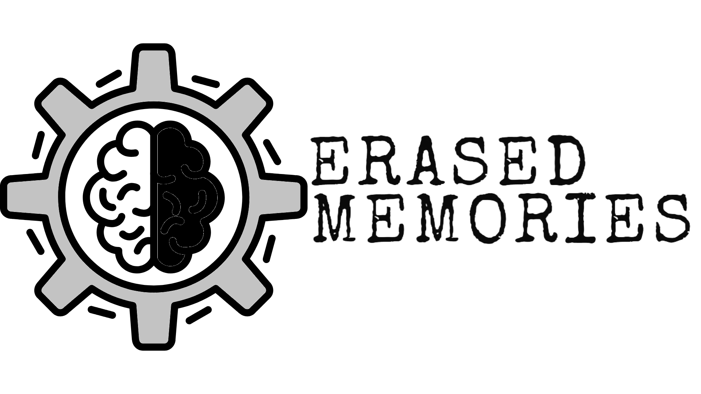

# Erased Memories Web Page
 This os the web page from the Erased Memories game.

 

 ### Install dependencies
 To install dependencies, run:
 ```bash
 npm i
 ```

### Local deployment
 In order to deploy the project locally, you will have to run:
```bash
 npm run dev
 ```


### Build
 To build the project, which is needed for firebase hosting, run:
 ```bash
 npm run build
 ```

 ### Firebase hosting
 This project has Firebase tools integrated, so the webapp can be hosted running this command:
 ```bash
 firebase deploy
 ```

